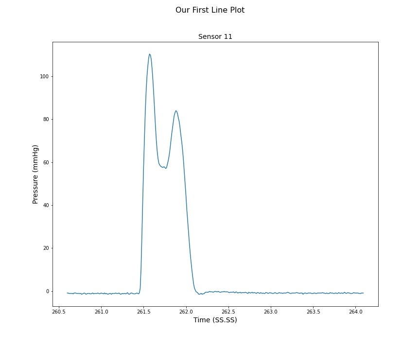
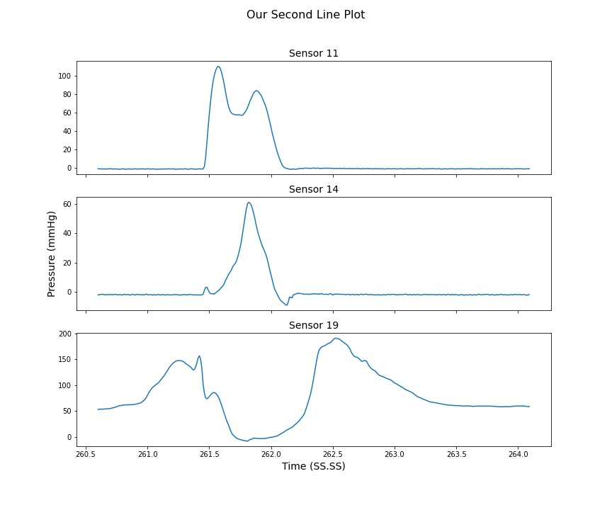
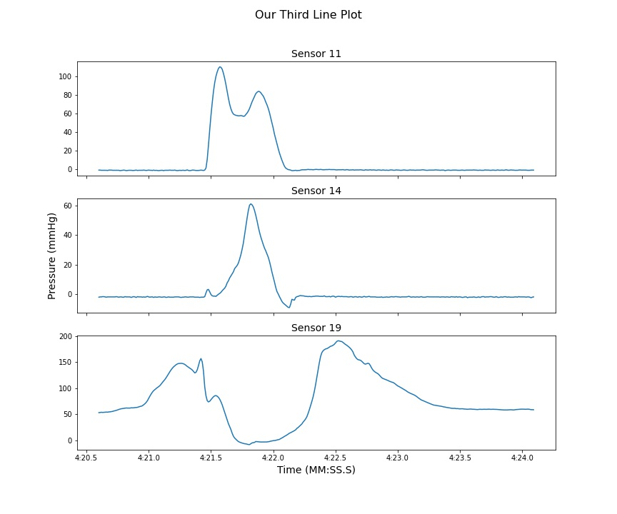
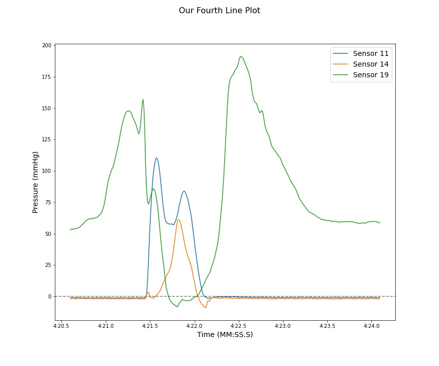
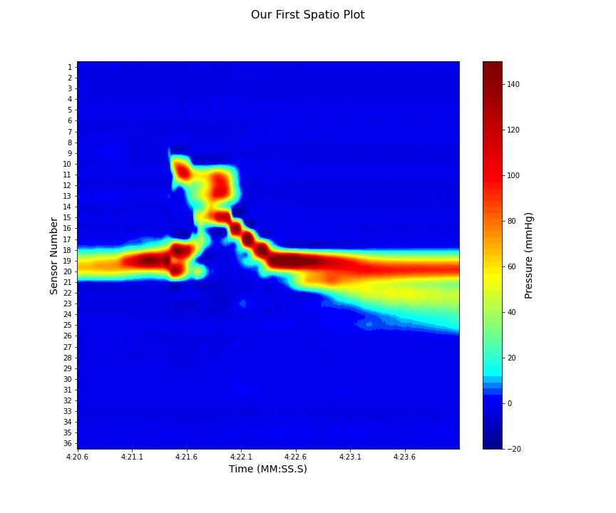

<h1 align="center">HRMTools Project</h1>
<p align="center">
 
</p> <br>

**Welcome** to the HRMTools Project. This project was designed to serve as a code base for working with high-resolution manometry data (HRM). This module was written in **Python** and should be easy to follow with plenty of descriptions of each module of code. Feel free to inspect the function headers and comments for further clarifcation. If you have any questions contact the auther Chris Ulmschneider (ulmschneider.chris@gmail.com).
## Purpose
This project was designed as a starting toolset for working with HRM data in Python. It facilitates:
1. Importing text data 
2. Segmenting data 
3. Plotting spatio-temporal plots
4 Plotting single sensor line plots
5. Plotting multiple sensors on one line plot
## Requirments
This code is designed to work with ManoScan 360 catheters with 36 channels of data. If another system's text file data is used with this code it will likely not work properly due to it expecting specific formatting of the text file. The code also expects the data as a txt format. This can be performed using ManoView and "Save Selected Data" option to create a text file version of the data. You can feel free to adapt this code to facilitate working with your own text files. 
## How to use this code
First make sure you have downloaded this module from **GitHub**. To do so run the following command in the terminal. 
```
pip install git+git:/github.com/chris-ulmy/hrmtools.git@main
```
This will clone the repository into your python environment and install the required packages. <br>

### Import data
After creating a new python file import the HRM class into your project.
```python
from hrmtools.hrm import HRM
```
Establish an instance of the HRM object and import the HRM data from a text file.
```python
txt_path = "C:/users/ulmschneider/Desktop/HRM_data.txt"
H = HRM()
H.import_data.from_text(txt_path)
print(H.data)
```
The output will look something like this:
```
Data(pressures=pandas.dataframe of shape (133250, 36), annotations=pandas.dataframe of shape 77)
```
This indicates the file imported successfully and the data is stored in the data class. You can see the shape of the pressures data and the number of annotations included in the file.

### HRM class structure
Within the HRM class there are numerous sub-classes.
 - `import_data` : This class imports the data from a text file.
 - `data` : This class will store the imported data. The pressure data and the annotation data are stored seperately.
 - `plot` : This class handles all of the plotting functions.

### Segmenting the data
You can provide segments in two formats. 
 - As a list/tuple of float numbers such as `(260.6, 264.1)`
 - As a list/tuple of strings such as `("4:20.6", "4:24.1")`. 

This can accomodate the M:SS.S format that ManoView utilizes or it  can accomodate the raw SS.S format. Using this knowledge we can now segment the data. 
```python
z, a = H.get_segment(time_seg=("4:20.6", "4:24.1"), sensors=[4, 5, 6])
print("z = ")
print(z)
print("a = ")
print(a)
```
The `get_segment()` function takes two arguments. `time_seg` is mandatory and follows the format discussed above. `sensors` is optional and should be provided as an iterable such as list/tuple or `range` object. If a single sensor is desired it should still be given as a list/tuple such as `[5]`. If nothing is provided it will default to all 36 sensors. <br>

The output will look something like this:
```python
z = 
           4     5     6
Time                    
260.60 -2.13 -0.81 -1.35
260.61 -2.00 -0.81 -1.35
260.62 -1.86 -0.81 -1.35
260.63 -2.00 -0.81 -1.51
260.64 -2.13 -1.01 -1.51
...      ...   ...   ...
264.05 -2.00 -0.81 -1.51
264.06 -1.72 -0.60 -1.51
264.07 -2.13 -1.21 -1.67
264.08 -2.13 -1.01 -1.51
264.09 -2.00 -0.81 -1.51

a = 
Empty DataFrame
Columns: [Text]
Index: []
```

Here we see that `z` has populated with our segment of data containing sensors 4, 5, and 6 inbetween the time interval 260.60 seconds to 264.09 seconds. There were no annotation markers in this segment so `a` is returned as an empty dataframe. <br>

You can use this variable `z` to do countless further manipulations and calculations. For example, to get the mean pressure for each sensor during this time interval.
```python
print(z.mean())
```
The output looks like this:
```
4   -1.843600
5   -0.787114
6   -1.422257
dtype: float64
```
Pandas dataframes have many different functions which can be found on [their website](https://pandas.pydata.org/docs/reference/api/pandas.DataFrame.html) <br>

### Generating a line plot
It is very easy to generate line plots using the `plot` class. This class utilizes the **matplotlib** package to generate the graphs.
```python
H.plot.line.create(time_seg=(260.6, 264.1), sensors=[11], title="Our First Line Plot", show=True)
```
Here we are using the `create()` function of the `line` class. This function takes several agruments. `time_seg` and `sensors` are the same as `get_segment()` function above. `title` is an optional argument that allows us to specify the plot's title. If not provided it will default to "HRM Plot". Finally `show` is another optional arugment that will tell **matplotlib** to show the plot or simply create it and store the figure. This option defaults to `True`. <br>

That output looks something like this:
<p align="center">
 
</p> <br>

We can also create multiple sensor plots on the same figure by providing a longer list of sensors to the `create()` function as seen below.
```python
H.plot.line.create(time_seg=(260.6, 264.1), sensors=[11, 14, 19], title="Our Second Line Plot", show=True)
```
<p align="center">
 
</p> <br>

Additionally, we can modify how the time is displayed on the x-axis by using the `time_in_min` property of the `plot` class. This defaults to `False` so the time is displayed in SS.SS format. See below for how to do this. 
```python
H.plot.time_in_min = False
H.plot.line.create(time_seg=(260.6, 264.1), sensors=[11, 14, 19], title="Our Third Line Plot", show=True)
```
<p align="center">
 
</p> <br>

Finally, we can graph multiple sensors on top of each other in the same axes. This is done using the `create_overlay()` function. This function takes the same arguments as the `create()` function.
```python
H.plot.line.create_overlay(time_seg=(260.6, 264.1), sensors=[11, 14, 19], title="Our Fourth Line Plot", show=True)
```
<p align="center">
 
</p> <br>

Notice the x-axis label is still MM:SS.S format because we have not changed the `time_in_min` property.

### Generating a spatio-temporal plot
The `plot` class can also be used to make spatio-temporal plots. To do so we will use the `spatio` class which has the function `create()` similar to the `line` class. This function takes the same arguments as well. Here we will leave the `sensors` argument out so that the default value of all 36 sensors will be used. 
```python
H.plot.spatio.create(time_seg=(260.6, 264.1), title="Our First Spatio Plot", show=True)
```
<p align="center">
 
</p> <br>

### Exporting back to a text file
If you edit the dataframes containing the pressure data or the annotations, you can re-export them to a text file for later use. Provide a path to the location you want to save the text file to the `save_to_text()` function as shown below.
```python
H.save_to_text("C:/users/ulmschneider/Desktop/New_data.txt")
```

That's it! You now know how to work with the `hrmtools` object. Enjoy! 

## To do
This is a list of the items that need to be added to the project still.
1. Functionality for performing multiple calculations on a data segment and displaying them for the user.
2. Functionality for plotting annotation lines on the line plot and spatio plots. Some of these functions are already in the code base but they may not work as expected.
3. Functionality to import 3D HRM data. This involves 128 extra columns of data and would require a new plotting method. 